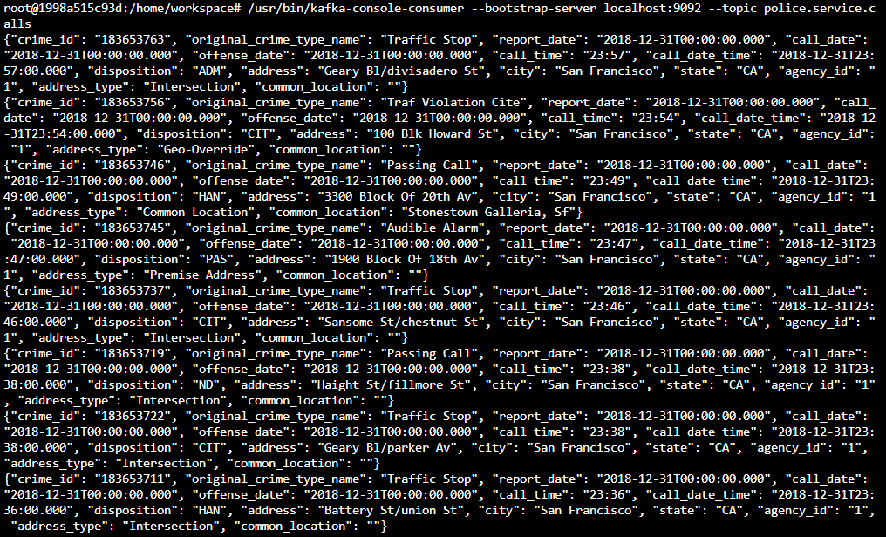
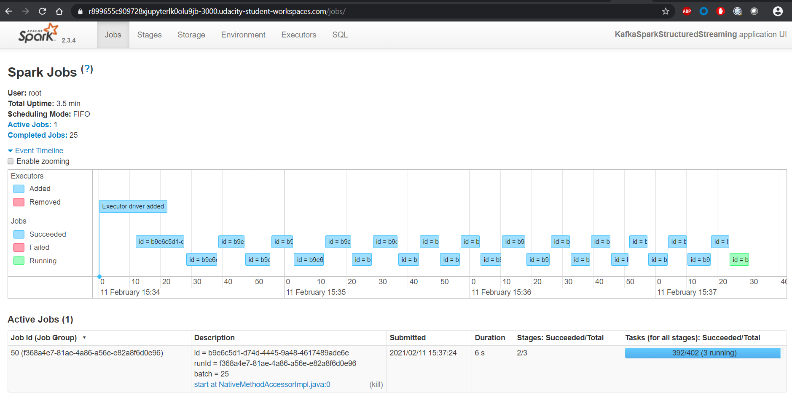
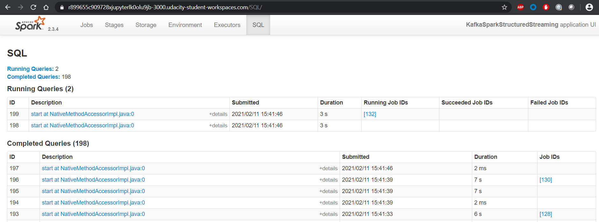

# SF Crime Statistics with Spark Streaming

Stream a dataset on San Francisco crime incidents using and conduct statistical analyses using Apache Spark Structured Streaming.

## Setup

### Python

Install packages in Python >= 3.6 with

```bash
pip install -r requirements.txt
```

### Kafka

Start Zookeeper and Kafka servers by running the following two commands in separate terminal sessions.

```bash
/usr/bin/zookeeper-server-start config/zookeeper.properties
```

```bash
/usr/bin/kafka-server-start config/server.properties
```

Ingest data from the json file and send messages to Kafka by running

```bash
python kafka_server.py
```

Check if Kafka receives messages which can be properly consumed by either executing

```bash
/usr/bin/kafka-console-consumer --bootstrap-server localhost:9092 --topic police.service.calls --from-beginning
```

or

```bash
python consumer_server.py
```



### Spark

```bash
spark-submit --packages org.apache.spark:spark-sql-kafka-0-10_2.11:2.3.4 --master local[*] data_stream.py
```

Below is a snippet of the progress report output in the console.

```text
2021-02-11 16:10:25 INFO  CodeGenerator:54 - Code generated in 10.905188 ms
+------------------------+-----+
|original_crime_type_name|count|
+------------------------+-----+
|                     853|    1|
|                     800|    3|
|          Person W/knife|    4|
|            Passing Call|    5|
|      Auto Boost / Strip|    8|
|                     919|    1|
|                 Poss Ip|    1|
|               Fire Lane|    1|
|                     Npa|    1|
|                  7.2.25|    2|
|                800 Poss|    2|
|               Roommates|    1|
|                     415|    4|
|                     Ams|    1|
|                  Nabors|    1|
|               Poss 5150|    1|
|                    Rave|    1|
|                  22500b|    2|
|               917 Drugs|    1|
|                   Drugs|    7|
+------------------------+-----+
only showing top 20 rows

2021-02-11 16:10:25 INFO  WriteToDataSourceV2Exec:54 - Data source writer org.apache.spark.sql.execution.streaming.sources.MicroBatchWriter@61db072c committed.
2021-02-11 16:10:25 INFO  SparkContext:54 - Starting job: start at NativeMethodAccessorImpl.java:0
2021-02-11 16:10:25 INFO  DAGScheduler:54 - Job 1 finished: start at NativeMethodAccessorImpl.java:0, took 0.000059 s
2021-02-11 16:10:25 INFO  MicroBatchExecution:54 - Streaming query made progress: {
  "id" : "239766e5-4906-4ea9-8d6b-5d8f8d26c114",
  "runId" : "f2b89f03-c69c-4b8b-a116-ec330c9f45c5",
  "name" : null,
  "timestamp" : "2021-02-11T16:10:04.541Z",
  "batchId" : 0,
  "numInputRows" : 2258,
  "processedRowsPerSecond" : 109.51064552112129,
  "durationMs" : {
    "addBatch" : 16243,
    "getBatch" : 228,
    "getOffset" : 3307,
    "queryPlanning" : 780,
    "triggerExecution" : 20618,
    "walCommit" : 41
  },
  "stateOperators" : [ {
    "numRowsTotal" : 233,
    "numRowsUpdated" : 233,
    "memoryUsedBytes" : 72351
  }, {
    "numRowsTotal" : 585,
    "numRowsUpdated" : 585,
    "memoryUsedBytes" : 148391
  } ],
  "sources" : [ {
    "description" : "KafkaSource[Subscribe[police.service.calls]]",
    "startOffset" : null,
    "endOffset" : {
      "police.service.calls" : {
        "1" : 1131,
        "0" : 1127
      }
    },
    "numInputRows" : 2258,
    "processedRowsPerSecond" : 109.51064552112129
  } ],
  "sink" : {
    "description" : "org.apache.spark.sql.execution.streaming.ConsoleSinkProvider@75154b5d"
  }
}
2021-02-11 16:10:25 INFO  MicroBatchExecution:54 - Committed offsets for batch 1. Metadata OffsetSeqMetadata(0,1613059825296,Map(spark.sql.shuffle.partitions -> 200, spark.sql.streaming.stateStore.providerClass -> org.apache.spark.sql.execution.streaming.state.HDFSBackedStateStoreProvider))
2021-02-11 16:10:25 INFO  KafkaSource:54 - GetBatch called with start = Some({"police.service.calls":{"1":1131,"0":1127}}), end = {"police.service.calls":{"1":1141,"0":1134}}
```





## Questions

#### How did changing values on the SparkSession property parameters affect the throughput and latency of the data?

We can set `spark.executor.cores` to the number of partitions of the kafka topic, to increase parallelism, which will reduce latency given the same throughput.

We can increase `maxRatePerPartition` and `maxOffsetsPerTrigger` to ingest more records processed per microbatch. It will result in greater throughput, for it reduces the overhead for processing a batch regardless of its size. However, it will also increase latency of the data, since it takes longer to accumulate more messages before a batch is processed.

#### What were the 2-3 most efficient SparkSession property key/value pairs? Through testing multiple variations on values, how can you tell these were the most optimal?

-   The system is stable. None of the executors or drives runs out of memory or exceeds CPU.
-   The processing time is less than the batch time, i.e. `inputRowsPerSecond` no greater than `processedRowsPerSecond`, so there won't be unprocessed data accumulating over time.
-   High throughput and low latency. Tweaking partitions and cores, such as `spark.executor.cores`, `spark.default.parallelism` and `maxRatePerPartition`.
